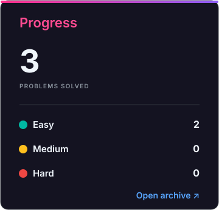
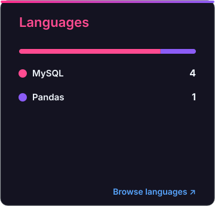
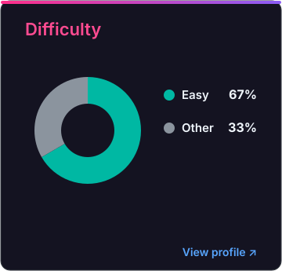

# LeetCode Solutions

A collection of accepted LeetCode solutions automatically synced by LeetBridge.

<!-- SOLUTIONS_START -->

<!-- LEETBRIDGE_ARCHIVE_CELLS_V3 -->

<picture>

</picture>

<table align="center" width="100%">
<tbody>
<tr><td width="53%"></td><td width="17%"><picture></picture></td><td width="30%"></td></tr>
<tr><td width="53%"></td><td width="17%"><picture></picture></td><td width="30%"></td></tr>
<tr><td width="53%"></td><td width="17%"><picture></picture></td><td width="30%"></td></tr>
</tbody>
</table>

<!-- SOLUTIONS_END -->
